# 🏨 OTEL MİNİBAR TAKİP SİSTEMİ 
## BÖLÜM 4: AKIŞ ŞEMALARI VE İŞ AKIŞLARI

**Versiyon:** 1.0  
**Tarih:** 31 Ekim 2025

---

## 1. SİSTEM GENEL AKIŞ ŞEMASI

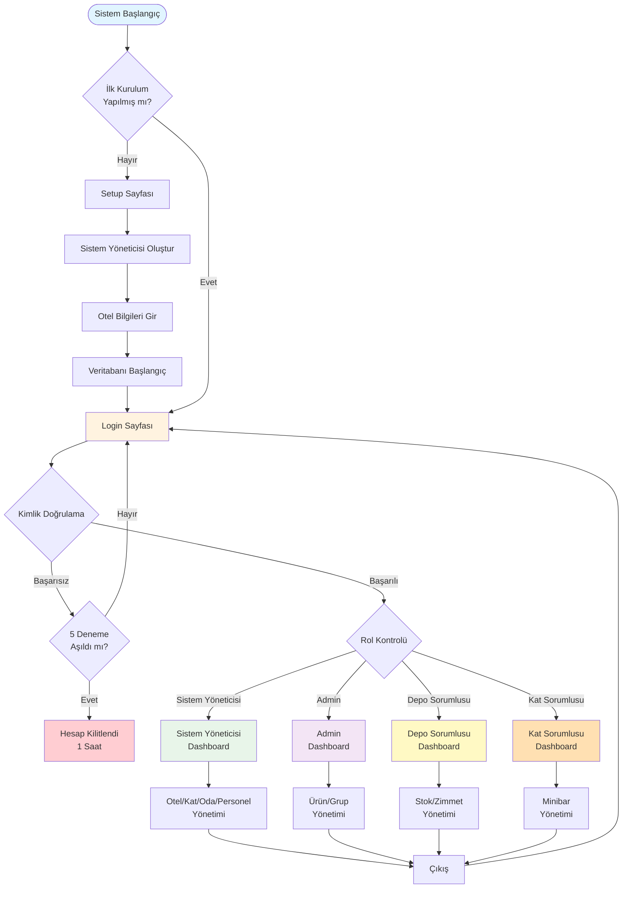

---

## 2. KULLANICI KİMLİK DOĞRULAMA AKIŞI

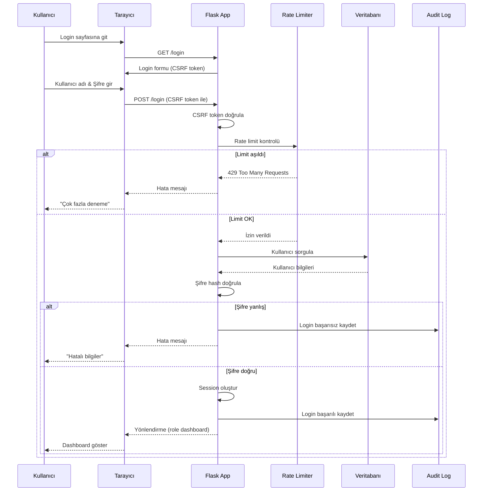

---

## 3. STOK YÖNETİMİ AKIŞI

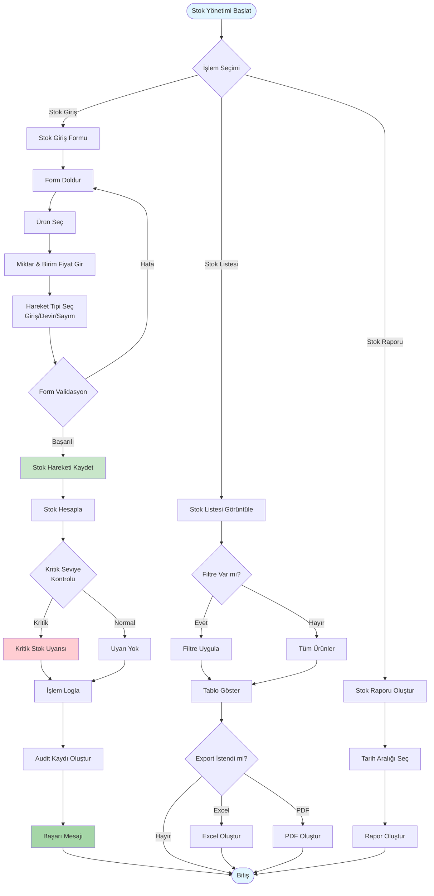

---

## 4. ZİMMET YÖNETİMİ AKIŞI

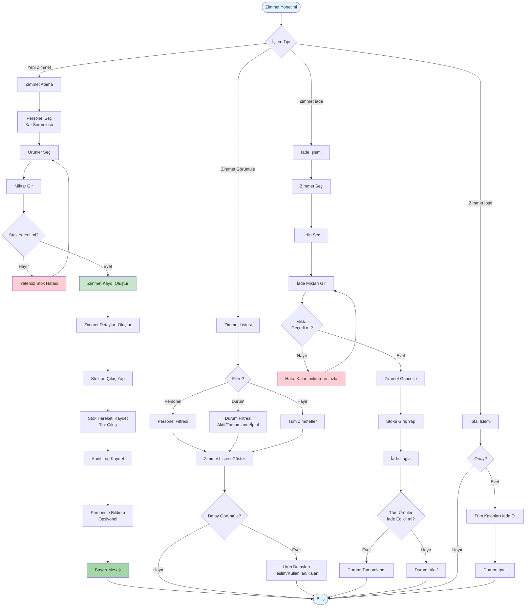

---

## 5. ZİMMET KULLANIM AKIŞI (FIFO)

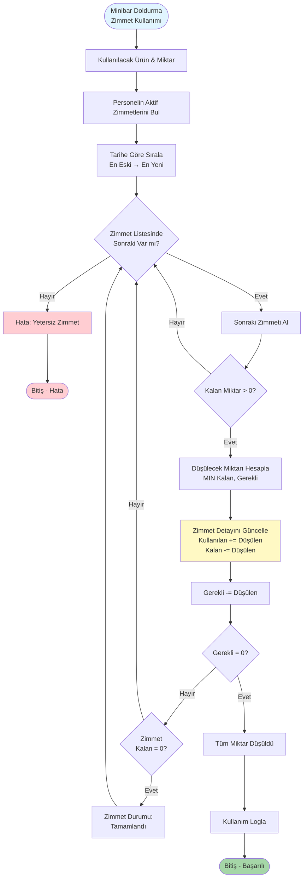

**FIFO Örnek Senaryo:**
```
Personel Zimmetleri:
1. Zimmet #001: Coca Cola - 100 adet (50 kullanılmış, 50 kalan) [01.10.2025]
2. Zimmet #002: Coca Cola - 200 adet (0 kullanılmış, 200 kalan) [15.10.2025]
3. Zimmet #003: Coca Cola - 150 adet (0 kullanılmış, 150 kalan) [25.10.2025]

Kullanım İsteği: 80 adet Coca Cola

Algoritma:
1. Zimmet #001'den 50 adet düş (kalan 0) → Durum: Tamamlandı
2. Zimmet #002'den 30 adet düş (kalan 170) → Durum: Aktif
3. Toplam düşülen: 80 adet ✓

Sonuç:
- Zimmet #001: 100 kullanılmış, 0 kalan [Tamamlandı]
- Zimmet #002: 30 kullanılmış, 170 kalan [Aktif]
- Zimmet #003: 0 kullanılmış, 150 kalan [Aktif]
```

---

## 6. MİNİBAR İŞLEMLERİ AKIŞI

### 6.1 İlk Dolum Akışı

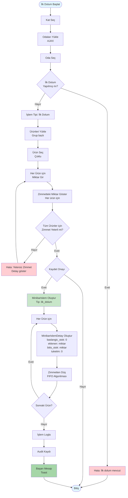

### 6.2 Kontrol Akışı

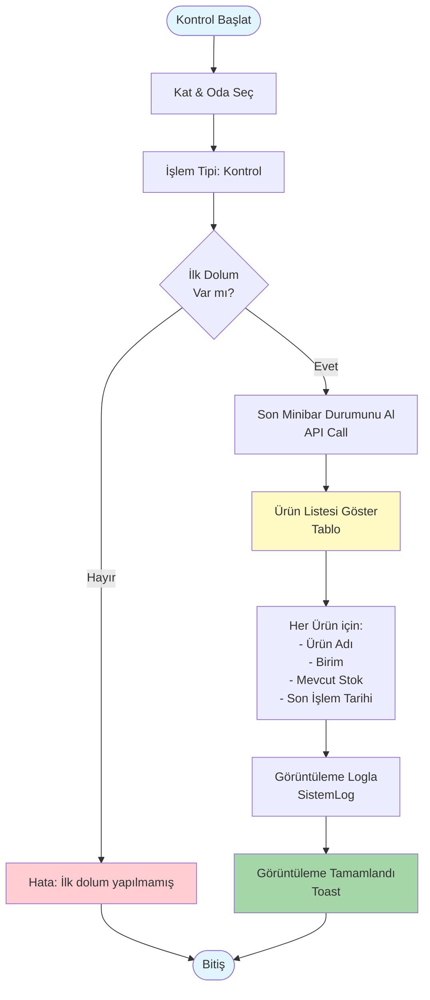

### 6.3 Doldurma (Tekli) Akışı

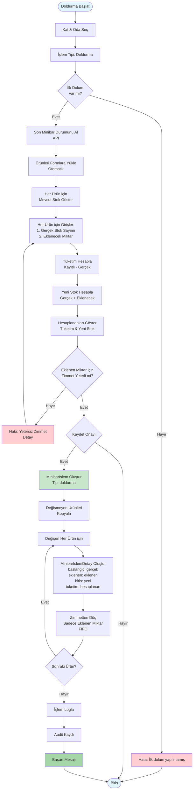

### 6.4 Toplu Oda Doldurma Akışı

```mermaid
graph TD
    Start([Toplu Doldurma]) --> SelectFloor[Kat Seç]
    SelectFloor --> LoadRooms[Odaları Yükle<br/>Checkbox List]
    LoadRooms --> SelectRooms[Odalar Seç<br/>Çoklu]
    SelectRooms --> SelectProduct[Ürün Seç<br/>Tek]
    SelectProduct --> EnterQty[Miktar Gir<br/>Tek Değer]
    
    EnterQty --> CalcTotal[Toplam Hesapla<br/>Oda Sayısı × Miktar]
    CalcTotal --> CheckZimmet{Toplam için<br/>Zimmet Yeterli mi?}
    
    CheckZimmet -->|Hayır| ZimmetError[Hata: Yetersiz Zimmet]
    ZimmetError --> EnterQty
    
    CheckZimmet -->|Evet| ShowCurrent{Mevcut Durum<br/>Göster İstendi mi?}
    ShowCurrent -->|Evet| DisplayCurrent[Her Oda için<br/>Mevcut Stok Göster]
    DisplayCurrent --> ConfirmBulk
    ShowCurrent -->|Hayır| ConfirmBulk
    
    ConfirmBulk{Toplu Doldur Onayı} -->|Hayır| End([Bitiş])
    
    ConfirmBulk -->|Evet| InitVars[Değişkenleri Başlat<br/>Başarılı Listesi<br/>Başarısız Listesi]
    InitVars --> LoopRooms[Her Oda için Sırayla]
    
    LoopRooms --> TryBlock{Try Bloğu}
    TryBlock --> GetRoomStatus[Odanın Son<br/>Minibar Durumu Al]
    GetRoomStatus --> CreateOp[MinibarIslem Oluştur]
    CreateOp --> CopyProducts[Diğer Ürünleri<br/>Kopyala]
    
    CopyProducts --> AddNew[Yeni Ürün Detayı Ekle<br/>baslangic: mevcut<br/>eklenen: miktar<br/>bitis: mevcut+miktar<br/>tuketim: 0]
    
    AddNew --> DeductZ[Zimmetten Düş<br/>FIFO]
    DeductZ --> AddSuccess[Başarılı Listesine Ekle<br/>Oda No]
    AddSuccess --> NextRoom
    
    TryBlock -->|Hata| LogError[Hatayı Logla]
    LogError --> AddFail[Başarısız Listesine Ekle<br/>Oda No + Hata Mesajı]
    AddFail --> NextRoom{Sonraki Oda?}
    
    NextRoom -->|Evet| LoopRooms
    NextRoom -->|Hayır| GenerateReport[Sonuç Raporu Oluştur]
    
    GenerateReport --> ShowReport[Rapor Göster:<br/>- Başarılı Oda Sayısı<br/>- Başarısız Oda Sayısı<br/>- Başarılı Odalar<br/>- Başarısız Detaylar<br/>- Kullanılan Zimmet]
    
    ShowReport --> End

    style Start fill:#e1f5ff
    style CreateOp fill:#c8e6c9
    style ZimmetError fill:#ffcdd2
    style LogError fill:#ffcdd2
    style ShowReport fill:#fff9c4
    style End fill:#e1f5ff
```

---

## 7. RAPORLAMA AKIŞI

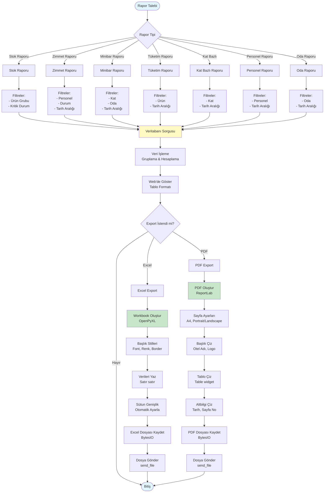

---

## 8. AUDİT TRAIL AKIŞI

```mermaid
graph TD
    Start([Sistem İşlemi]) --> CheckDecorator{@audit_trail<br/>Dekoratör Var mı?}
    
    CheckDecorator -->|Hayır| DirectOp[Direkt İşlem]
    DirectOp --> End([Bitiş])
    
    CheckDecorator -->|Evet| BeforeOp[İşlem Öncesi<br/>Durum Kaydet]
    BeforeOp --> ExecuteOp[İşlem Yürüt]
    ExecuteOp --> OpSuccess{İşlem<br/>Başarılı mı?}
    
    OpSuccess -->|Hayır| LogError[Hata Logla<br/>HataLog Tablosu]
    LogError --> End
    
    OpSuccess -->|Evet| AfterOp[İşlem Sonrası<br/>Durum Kaydet]
    AfterOp --> DetectChange[Değişiklikleri Tespit Et<br/>Eski vs Yeni]
    
    DetectChange --> HasChange{Değişiklik<br/>Var mı?}
    
    HasChange -->|Hayır| NoAudit[Audit Kaydetme]
    NoAudit --> End
    
    HasChange -->|Evet| SerializeOld[Eski Değerleri<br/>JSON'a Çevir]
    SerializeOld --> SerializeNew[Yeni Değerleri<br/>JSON'a Çevir]
    SerializeNew --> CreateSummary[İnsan Okunabilir<br/>Özet Oluştur]
    
    CreateSummary --> GetContext[Bağlam Bilgileri:<br/>- Kullanıcı ID<br/>- IP Adresi<br/>- User Agent<br/>- Oturum ID]
    
    GetContext --> CreateAudit[AuditLog Kaydı Oluştur:<br/>- Tablo Adı<br/>- İşlem Tipi<br/>- Kayıt ID<br/>- Eski Değerler JSON<br/>- Yeni Değerler JSON<br/>- Değişiklik Özeti<br/>- Kullanıcı<br/>- IP<br/>- Timestamp]
    
    CreateAudit --> SaveAudit[Veritabanına Kaydet]
    SaveAudit --> IndexLog[Full-text Index<br/>Arama için]
    IndexLog --> End

    style Start fill:#e1f5ff
    style CreateAudit fill:#c8e6c9
    style LogError fill:#ffcdd2
    style End fill:#e1f5ff
```

**Audit Trail Örnek Kayıt:**
```json
{
  "tablo_adi": "urunler",
  "islem_tipi": "update",
  "kayit_id": 15,
  "eski_deger": {
    "urun_adi": "Coca Cola",
    "birim_fiyat": 5.50,
    "kritik_seviye": 100
  },
  "yeni_deger": {
    "urun_adi": "Coca Cola",
    "birim_fiyat": 6.00,
    "kritik_seviye": 150
  },
  "degisiklik_ozeti": "Birim fiyat 5.50 TL'den 6.00 TL'ye güncellendi. Kritik seviye 100'den 150'ye yükseltildi.",
  "kullanici_id": 3,
  "ip_adresi": "192.168.1.100",
  "user_agent": "Mozilla/5.0...",
  "oturum_id": "abc123xyz",
  "timestamp": "2025-10-31 14:45:23"
}
```

---

## 9. GÜVENLİK VE RATE LİMİTİNG AKIŞI

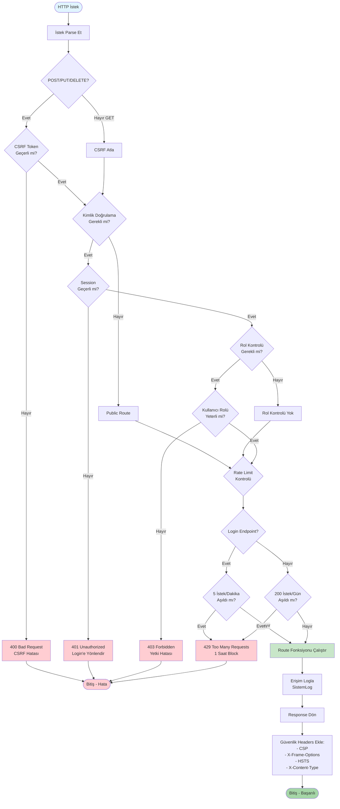

---

## 10. HATA YÖNETİMİ AKIŞI

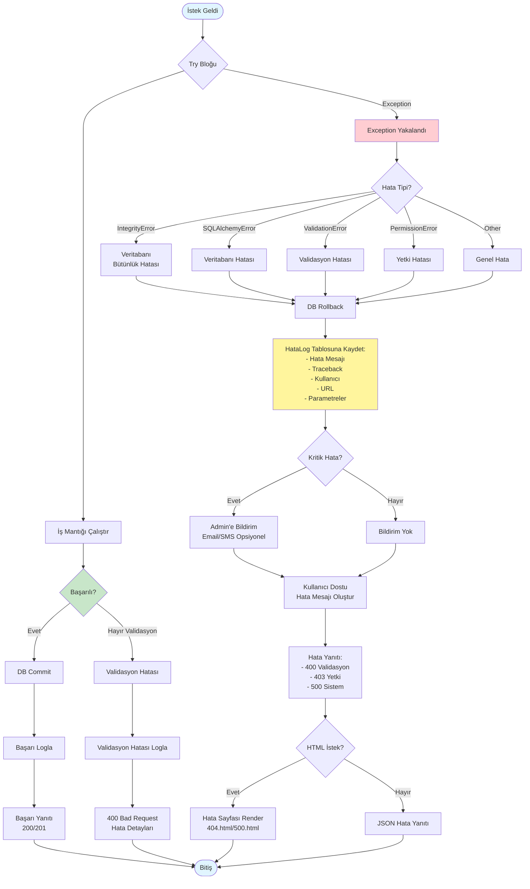

---

## 11. VERİ AKIŞ DİYAGRAMI

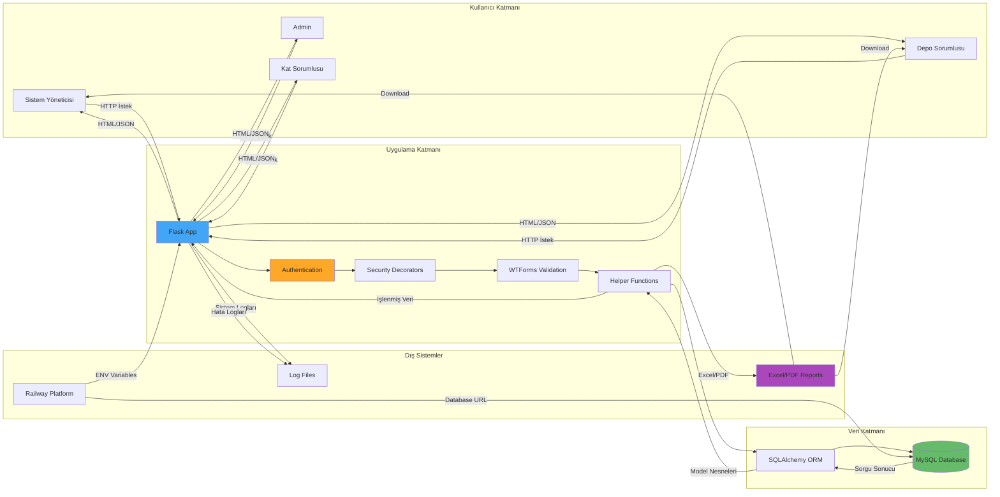

---

## 12. DEPLOYMENT AKIŞI (RAILWAY)

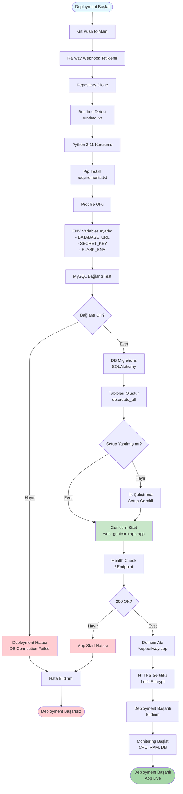

---

## 13. KRİTİK İŞ AKIŞLARI

### 13.1 Günlük İş Akışı - Kat Sorumlusu

```
1. Sabah (08:00)
   └─ Login yap
   └─ Dashboard kontrol et
      ├─ Zimmet durumunu gör
      └─ Son minibar işlemlerini incele

2. Oda Kontrolleri (09:00-12:00)
   └─ Her oda için:
      ├─ Minibar kontrol et (Kontrol işlemi)
      ├─ Tüketim varsa not al
      └─ Sonraki odaya geç

3. Minibar Doldurma (13:00-17:00)
   └─ Her oda için:
      ├─ Gerçek stok say
      ├─ Tüketimi kaydet
      ├─ Eksikleri doldur
      └─ Zimmetten düş

4. Toplu İşlemler (Gerektiğinde)
   └─ Aynı ürün için birden fazla oda
   └─ Toplu oda doldurma kullan

5. Akşam (17:30)
   └─ Zimmet durumunu kontrol et
   └─ Yetersiz zimmet varsa Depo'dan talep et
   └─ Günlük rapor oluştur
   └─ Logout
```

### 13.2 Günlük İş Akışı - Depo Sorumlusu

```
1. Sabah (08:00)
   └─ Login yap
   └─ Dashboard kontrol et
      ├─ Kritik stok uyarıları
      ├─ Zimmet talepleri
      └─ Minibar durumları

2. Stok Kontrolü (09:00-10:00)
   └─ Kritik stok ürünleri tespit et
   └─ Sipariş listesi hazırla
   └─ Satın alma ile iletişim

3. Stok Girişi (10:00-12:00)
   └─ Gelen ürünleri kaydet
   └─ Stok giriş işlemi yap
   └─ Depo yerleşimi

4. Zimmet Yönetimi (13:00-15:00)
   └─ Kat sorumlularından gelen talepler
   └─ Zimmet atama yap
   └─ Stoktan düşüm kontrolü

5. Minibar Takip (15:00-17:00)
   └─ Minibar durumlarını incele
   └─ Anormal tüketim tespit et
   └─ Oda bazlı ürün geçmişi

6. Raporlama (17:00-18:00)
   └─ Günlük stok raporu
   └─ Zimmet özet raporu
   └─ Kritik stok listesi
   └─ Logout
```

---

## 14. PERFORMANS OPTİMİZASYON AKIŞI

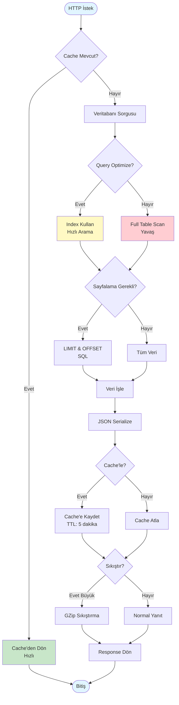


